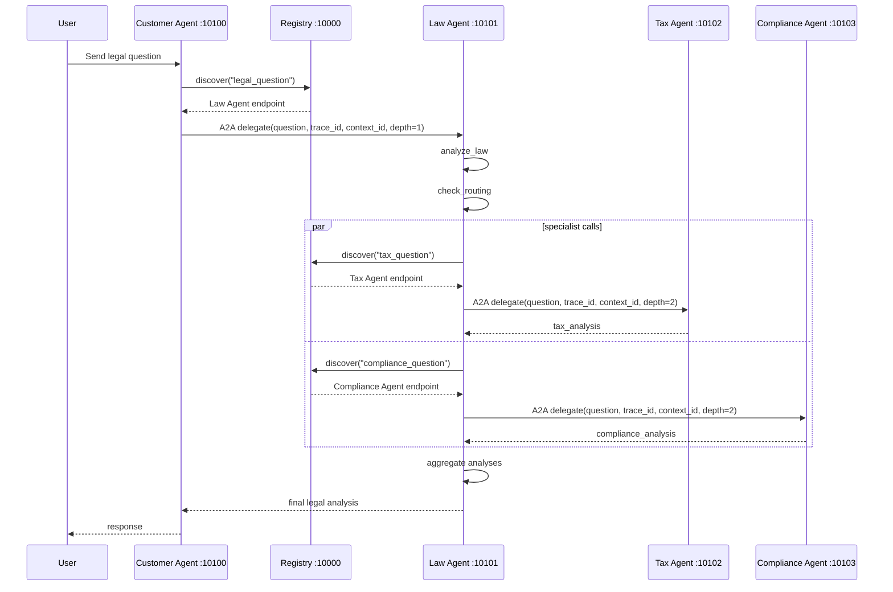

# Submission Report: Day26 Track03 MCP and A2A Infrastructure

Date: 2026-05-14

## Completed Items

- Exercise 2.1: added a Vietnamese labor law entry to `LEGAL_KNOWLEDGE`.
- Exercise 2.2: implemented `check_statute_of_limitations` and wired it into the tool loop.
- Exercise 4.1: implemented `privacy_agent`.
- Exercise 4.2: added conditional routing for tax, compliance, and privacy agents.
- Stage 5 trace requirement: verified the distributed A2A flow with Registry, Customer Agent, Law Agent, Tax Agent, and Compliance Agent.
- Windows run support: added `start_all.ps1`.
- No-credit run support: added `LAB_OFFLINE_MODE=1` for deterministic local verification when OpenRouter credits are unavailable.

## Verification Commands

Python used:

```powershell
C:\Users\tuank\AppData\Local\Programs\Python\Python311\python.exe --version
```

Result:

```text
Python 3.11.6
```

Syntax check:

```powershell
$env:LAB_OFFLINE_MODE='1'
& 'C:\Users\tuank\AppData\Local\Programs\Python\Python311\python.exe' -m py_compile common\llm.py common\offline_llm.py exercises\exercise_2_tools.py exercises\exercise_4_multiagent.py
```

Result: passed.

Exercise 2:

```powershell
$env:LAB_OFFLINE_MODE='1'
& 'C:\Users\tuank\AppData\Local\Programs\Python\Python311\python.exe' exercises\exercise_2_tools.py
```

Output:

```text
Câu hỏi: Thời hiệu khởi kiện vụ vi phạm hợp đồng là bao lâu?

Gọi tool: check_statute_of_limitations

Kết quả:
Theo kết quả tra cứu, thời hiệu phù hợp là: 4 năm (UCC § 2-725)
```

Exercise 4:

```powershell
$env:LAB_OFFLINE_MODE='1'
& 'C:\Users\tuank\AppData\Local\Programs\Python\Python311\python.exe' exercises\exercise_4_multiagent.py
```

Output:

```text
MULTI-AGENT SYSTEM với Privacy Agent

Câu hỏi: Nếu công ty bị rò rỉ dữ liệu khách hàng, hậu quả pháp lý và thuế là gì?

KẾT QUẢ CUỐI CÙNG
Vụ rò rỉ dữ liệu có thể kích hoạt nghĩa vụ thông báo sự cố, đánh giá tác động bảo vệ dữ liệu, biện pháp khắc phục cho khách hàng, và rủi ro phạt theo GDPR/CCPA nếu dữ liệu cá nhân được xử lý hoặc chuyển giao trái quy định.
```

Stage 5 services:

```powershell
powershell -ExecutionPolicy Bypass -File .\start_all.ps1 -PythonPath 'C:\Users\tuank\AppData\Local\Programs\Python\Python311\python.exe' -OfflineMode
Invoke-RestMethod http://localhost:10000/health
```

Output:

```text
status: ok
agent_count: 4
```

Stage 5 end-to-end client:

```powershell
$env:LAB_OFFLINE_MODE='1'
& 'C:\Users\tuank\AppData\Local\Programs\Python\Python311\python.exe' test_client.py
```

Output:

```text
Connected to agent: Customer Agent v1.0.0
RESPONSE:
Báo cáo tổng hợp offline:
1. Pháp lý: cần xác định vi phạm hợp đồng, thiệt hại, nghĩa vụ khắc phục và khả năng bồi thường.
2. Thuế: cần rà soát nghĩa vụ kê khai, tiền thuế thiếu, lãi, phạt dân sự và nguy cơ điều tra nếu có yếu tố cố ý.
3. Tuân thủ: cần kiểm tra nghĩa vụ báo cáo, kiểm soát nội bộ, governance và biện pháp remediation.
Nội dung này phục vụ mục đích học tập; trường hợp thực tế cần hỏi luật sư được cấp phép.
```

## Stage 5 Sequence Diagram



## Notes

- Direct OpenRouter runs reached the API but the configured account returned `402 Insufficient credits` for paid models.
- The default model was changed to `openrouter/free`, which OpenRouter documents as the zero-cost router for experimentation and education.
- `LAB_OFFLINE_MODE=1` is for local verification only. Without it, the project still uses OpenRouter through `common.get_llm()`.
